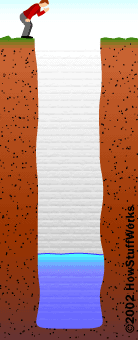
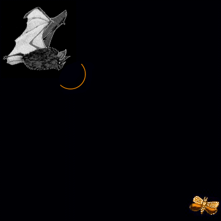

# Malakoffdomein (Grote Zenne)

**eigenaar:** [Agentschap voor Natuur- en Bos](https://www.natuurenbos.be/hallerbos)
**toegankelijkheid:** het Malakoffdomein is vrij toegankelijk. De Malakoffkelder wordt eenmaal per jaar opengesteld voor het publiek. Zie onze [activiteitenkalender](activiteiten.html).


Op deze pagina:

- Het [Malakoffdomein](#malakoffdomein).
- Vleermuizen kunnen [zien](#zien-in-het-donker) in het donker
- Weetjes over de [watervleermuis](#watervleermuis).

## Malakoffdomein {#malakoffdomein}

### Vormgegeven door de Zenne en het kanaal

Voor de aanleg van het kanaal Brussel-Charleroi was het Malakofdomein een deel van het park rond het kasteel van Lembeek. Tijdens de aanleg van het eerste kanaal (1827-1832) verkreeg hertog d'Ursel, heer van Lembeek, dat het kanaal ter hoogte van zijn park door een tunnel liep. Hierdoor konden slechts schepen tot 70 ton langs het kanaal varen. In 1857 werd het kanaal aangepast zodat schepen tot 280 ton konden varen en werd de tunnel noodgedwongen afgebroken.

Het kanaal werd aangelegd in de vallei van de Zenne. Hierbij werd de oorspronkelijke loop van de Zenne op een aantal plaatsen doorsneden. Daarom werd de loop van de Zenne aangepast zodat ze in Lembeek steeds aan de linkeroever van het kanaal blijft. Het gevolg hiervan waren twee afgelopen armen. Een grote arm die we nu nog herkenen als de vijvers in het Malakoffdomein. Een tweede, kleinere, arm vinden we een 600-tal meter naar het noorden. Deze twee armen worden ook wel de Grote en de Kleine Zenne genaamd.

Het reliëf van het gebied ziet er soms wat onnatuurlijk uit. Dat is het gevolg van het storten van de uitgegraven grond uit het kanaal. Hierdoor ligt de weide rond de Malakofftoren veel hoger dan oorspronkelijk.

### Malakofftoren

De Malakofftoren is de ietwat vreemde toren die zijn naam geeft aan het domein. Hoeveel het er uitziet als een middeleeuwse ruïne, is deze toren in werkelijkheid pas in 1854 gebouwd. En dat in de nagenoeg dezelfde toestand zodat je hem nu aantreft, enkel de betonnen wenteltrap is recenter. In die romantische periode stond het immers heel chique als je een ruïne in je kasteelpark had. Bij gebrek aan een echte ruïne werd dan wel eens een ruïne nagebouwd.

De toren werd op een bepaald moment als decor gebruikt bij het naslepen van de [slag bij Malachov](https://nl.wikipedia.org/wiki/Slag_bij_Malachov). Dat was een veldslag in de Krimoorlog waarbij de Russen op 7 september 1855 verslagen werden door de Fransen en de Britten.

### Malakoffkelder

Een beetje verborgen op het terrein kan je de nieuwe ingang van de Malakoffkelder vinden. De koepel is gebouwd met lokale blauwe hardsteen en heeft bewust zeer ruwe randen gekregen.

De kelder was op een bepaald moment behoorlijk vervallen. Een deel van de gang en het dak was ingestort. Op dat moment werd de kelder reeds door vleermuizen als winterverblijfplaats gebruikt. Herman Van Schepdael, Hugo Van Bochaute en Philippe Descuyffeleer hebben eigenhandig, en met financiële ondersteuning van het Agentschap voor Natuur en Bos, de kelder gerestaureerd en gelijktijdig aangepast zodat vleermuizen er ongestoord kunnen overwinteren.

Eerst werd gestart met het herstel van de kelder en oorspronkelijke gang. De ingang van deze gang werd dichtgemetst. Aan de andere kant was immers een opening in de kelder die nu als nieuwe ingang gebruikt werd. Omdat vleermuizen graag een stabiel microklimaat hebben, werd voor de nieuwe ingang een gang van 37m lang gebouwd. Deze staat haaks op de ingang van de kelder en bevat twee binnendeuren die de instroom van koude buitenlucht beperken. De bezoekers aan het Malakoffdomein zien enkel de toegang van deze gang. Deze is afgesloten met een stevig hek om vandalisme en verstoring van de vleermuizen te vermijden. De dikke laag grond over de kelder zorgt ervoor dat het klimaat goed gebufferd. De temperatuur schommelt tussen 8° in de winter en 10° in de zomer.

### Wandelen in het Malakoffdomein

```{r load_packages, include = FALSE}
library(knitr)
opts_chunk$set(
  echo = FALSE,
  message = FALSE,
  warning = FALSE
)
library(htmlwidgets)
setWidgetIdSeed(1)
library(leaflet)
library(tibble)
library(rgdal)
library(rgeos)
```

```{r lees_geojson}
route <- readOGR(
  "route/route.geojson", 
  "OGRGeoJSON", 
  verbose = FALSE
)
infopunt <- readOGR(
  "route/infopunt.geojson", 
  "OGRGeoJSON", 
  verbose = FALSE
)
object <- readOGR(
  "route/object.geojson", 
  "OGRGeoJSON", 
  verbose = FALSE
)
object$verblijf <- ifelse(
  object$vleermuis == 0,
  0,
  ifelse(object$winter == 1, 1, 2)
) %>%
  factor(
    levels = 0:2, 
    labels = c("geen vleermuizen", "winterverblijf", "zomerverblijf")
  )
```

```{r stijlen}
route_kleur <- c("red", "black", "magenta")
object_icoon <- awesomeIconList(
  "geen vleermuizen" = makeAwesomeIcon(icon = "building-o", library = "fa"),
  winterverblijf = makeAwesomeIcon(icon = "building", library = "fa", markerColor = "green"),
  zomerverblijf = makeAwesomeIcon(icon = "building", library = "fa", markerColor = "pink")
)
infopunt_icoon <- makeAwesomeIcon(icon = "info", library = "fa", markerColor = "red")
```

Je kan het Malakoffdomein te voet verkennen. De kaart duidt de wandelwegen aan die je naar de Malakofftoren, de Malakoffkelder en de oude Zennearm brengen.

```{r detailkaart, out.width="100%", out.height="900px"}
leaflet(route) %>%
  addProviderTiles("Thunderforest.OpenCycleMap", group = "fietskaart") %>%
  addProviderTiles("OpenTopoMap", group = "topokaart") %>%
  addProviderTiles("Esri.WorldImagery", group = "sateliet") %>%
  addPolylines(color = ~route_kleur[categorie], group = "route") %>%
  addAwesomeMarkers(
    data = infopunt, 
    icon = infopunt_icoon, 
    group = "infopunt"
  ) %>%
  addAwesomeMarkers(
    data = object, 
    icon = ~object_icoon[verblijf], 
    label = ~naam,
    group = "object"
  ) %>%
  addScaleBar(options = scaleBarOptions(maxWidth = 100, imperial = FALSE)) %>%
  addLegend(
    title = "type route",
    colors = route_kleur, 
    values = 1:3, 
    labels = levels(route$categorie)
  ) %>%
  addLayersControl(
    baseGroups = c("fietskaart", "topokaart", "sateliet"),
    overlayGroups = c("route", "infopunt", "object"),
    options = layersControlOptions(collapsed = FALSE)
  ) %>%
  setView(4.232, 50.7113, zoom = 17)
```


## Vleermuizen kunnen "zien" in het donker {#zien-in-donker}

Vleermuizen maken gebruiken van _echolocatie_. Op sommige plaatsen in de bergen of bij een diepe put, hoor je je eigen stem iets later opnieuw nadien je iets riep. Wat er gebeurd is dat het geluid van jouw stem vertrekt vanaf je mond in de richting waar je roept. Wanneer het geluid ergens tegen bots (een bergwand of de bodem van de put) keert het terug en hoor je een echo. Geluid verplaatst zich tegen ongeveer 330 meter per seconde door de lucht. Dus als je de tijd meet tussen jouw roep en moment dat je de echo hoort, kan je afstand berekenen. Stel dat je de echo na 2 seconden hoort. Dan heeft het geluid $2s \times 330 m/s = 660 m$ afgelegd. Die afstand moeten we nog door twee delen, het geluid is immers heen en terug moeten gaan. Bijgevolg is het obstakel $330m$ van ons verwijderd.

Vleermuizen zijn meesters in het gebruik van echo. Ze roepen voortdurend en luisteren naar hun echo. Vleermuizen zijn er zo goed in dat ze een onderscheid tussen maken tussen de verschillende obstakels waartegen hun roep bots: insecten, bomen, bladeren, grond, muren, andere vleermuizen, mensen, ... Stel dat een obstakel aan de linkerkant van de vleermuis is. Dan is het linkeroor van de vleermuis twee centimeter dichter bij het obstakel dan het rechteroor. Hierdoor zal het linkeroor de echo een heel klein beetje eerder horen dan het rechteroor. Het verschil is slechts 60 miljoenste van een seconde!

Door gebruik te maken van echolocatie kunnen vleermuizen zonder problemen door het donker vliegen. Ze "zien" (eigenlijk eerder "horen") waar alle obstakels staan. Dingen te kunnen zien met de ogen is er altijd licht nodig. Zo heeft een kat genoeg aan het licht van de maan en de sterren om 's nachts rond te kunnen lopen. In een volledig donkere ruimte zal een kat evenmin iets kunnen zien.

Vleermuizen gebruiken geluiden met zeer hoge tonen, deze zijn zo hoog dat mensen ze niet meer kunnen horen. We noemen dit ultrasone geluiden. Vleermuisonderzoekers gebruiken daarom een zogenaamde _batdetector_. Dit toestel zet de ultrasone geluiden om naar voor de mensen hoorbare geluiden. **link naar een ultrasone opname**.

### Wist je dat...

... vleermuizen niet blind zijn? Sommige vleermuissoort hebben zelfs vrij grote ogen zodat ze op het zicht kunnen jagen in plaats van met echolocatie
... sommige insecten kunnen luisteren naar de echolocatie van vleermuizen? Als ze horen dat een vleermuis vlakbij is, laten ze zich pardoes vallen in een poging te vleermuis te ontwijken.
... wanneer vleermuizen in grotten vliegen ze goed kennen doen ze dat soms zonder hun echolocatie te gebruiken.

## Watervleermuis {#watervleermuis}

(Kolonie watervleermuizen. Foto: Hugo Willocx)[images/watervleermuis_kolonie_HugoWillocx.jpeg]

### Weetjes

- Als ik mijn vleugels spreid, ben ik 24 tot 28 cm breed.
- Ik weeg 7 tot 17 gram.
- Ik ben verzot op muggen en andere insecten die boven water vliegen. Mijn grote voeten gebruik ik om de insecten van het water te scheppen.
- Tijdens de zomer slaap ik overdag graag in een oud spechtenhol of een andere holte in een boom
- Tijdens de winter verstop ik met liefst in een grot. Ondergrondse bouwsels zoals tunnels of forten die een beetje op een grot lijken vind ik ook prima. Als het maar rustig, donker en vochtig is.

### Video's

Watervleermuis schept een insect van het wateroppervlak  
<iframe width="640" height="360" src="https://www.youtube-nocookie.com/embed/Gxy5Gjb-cSw?rel=0&amp;showinfo=0" frameborder="0" allowfullscreen></iframe>

Watervleermuis jaagt boven een rivier (nachtkijker)  
<iframe width="640" height="360" src="https://www.youtube-nocookie.com/embed/j_6zvF7kQOw?rel=0&amp;showinfo=0" frameborder="0" allowfullscreen></iframe>

Een kolonie watervleermuizen in een holle boom  
<iframe width="640" height="360" src="https://www.youtube-nocookie.com/embed/eZQ8q0isNYE?rel=0&amp;showinfo=0" frameborder="0" allowfullscreen></iframe>
