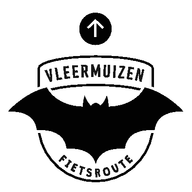

## Route

Het station van Halle is het startpunt en het eindpunt van de fietsroute. De volledige route is bewegwijzerd met onderstaande symbool.

## Erfgoedapp

Extra informatie over de fietsroute is beschikbaar via de erfgoedapp. Je kan deze downloaden via http://www.erfgoedapp.be/

