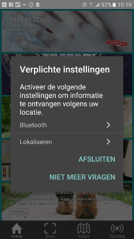
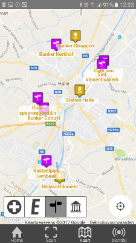
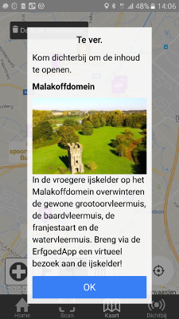
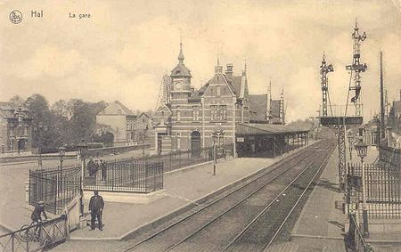
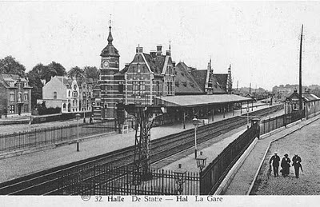

# Station Halle

**eigenaar:** [NMBS](https://www.b-rail.be)
**toegankelijkheid:** het station is vrij toegankelijk.

Op deze pagina:

- De [bewegwijzering](#wegwijzer) van de route.
- Korte handleiding van de [Erfgoedapp](#erfgoedapp)
- Weetjes over het [station van Halle](#station)

<iframe src="https://player.vimeo.com/video/151409529" width="640" height="360" frameborder="0" webkitallowfullscreen mozallowfullscreen allowfullscreen></iframe>
<p><a href="https://vimeo.com/151409529">Het belang van vleermuizen</a> from <a href="https://vimeo.com/inverde">Inverde</a> on <a href="https://vimeo.com">Vimeo</a>.</p>

## Route {#wegwijzer}

Het station van Halle is het startpunt en het eindpunt van de fietsroute. De volledige route is bewegwijzerd met onderstaande symbool.


## Erfgoedapp {#erfgoedapp}

Via de ErgoedApp van Faro bieden wij de fietser een extra laag van beleving aan.

Zo kan je virtueel de deuren openen van verschillende bunkers alsook een 360° bezoek maken van de ijskelder in het Malakoff domein en de kerkzolder met invliegopeningen van de Sint-Vincentiuskerk.

Hoe gaat dit in zijn werk?

Stap 1:

Download de ErfgoedApp:
http://www.erfgoedapp.be/

```{r setup, include = FALSE}
library(knitr)
opts_chunk$set(
  echo = FALSE,
  fig.width = 3,
  fig.height = 3
)
library(qrcode)
android <- "https://play.google.com/store/apps/details?id=be.faro.erfgoedapp"
ios <- "https://itunes.apple.com/be/app/erfgoedapp/id998845080"
```

**Android** app in Google Play: 
`r android`  
```{r android}
qrcode_gen(android, wColor = "transparent")
```

**iOS** app in iTunes:  
`r ios`  
```{r ios}
qrcode_gen(ios)
```

Stap 2:

Activeer op je smartphone Bluetooth, locatie en mobiele data

 

Stap 3:

Via kaart heb je een overzicht van alle stopplaatsen met korte informatie.



Stap 4:

Eens je dicht genoeg bent activeer je de virtuele content die met elke stopplaats gelinkt is.



Stap 5:

Geniet ervan!

## Station Halle vroeger en nu {#station}

Het decoratieve station in neo-Vlaamse Renaissancestijl werd in 1887 gebouwd naar ontwerp van architect H. Fouquet (die o.m. ook tekende voor de stations van Leuven en Harelbeke). Misschien inspireerde de architect zich op het Halse stadhuis uit de 16de eeuw. Het station werd uitgewerkt met drie evenwaardige gevels, in baksteen rijkelijk versierd met blauwe hardsteen. Er werd gestreefd naar een pittoresk uiterlijk door een boeiend spel van puntgevels en onregelmatige verdeling van de gevelvlakken.

Fouquet volgde de architectuurideologie die toen door de Belgische Staatspoorweg (en de overheid van dat ogenblik) gehuldigd werd. Men wilde door het gebruik van grote 'nationale' stijlen opnieuw aanknopen bij het grootse verleden van het vaderland. De stations moesten derhalve de reiziger een les in architectuurgeschiedenis bieden, en de nationale gevoelens opwekken.

Het station van Halle moest grote aantallen reizigers en goederen opvangen, bedienen en verdelen. De ingang tot het station leidt tot een ruime hal die toegang geeft tot het bureau van de telegraaf, de loketten, de bagage-ruimte en de wachtzalen. Er was een wachtzaal voor de burgerij (de eerste en de tweede klasse), en een wachtzaal voor het gewone volk (derde klasse). Beide waren met zorg van elkaar gescheiden... omdat er in de derde klasse te veel gerookt werd.

Het station van Halle had een merkwaardigheid. Het had een uitzonderlijk grote zomerwachtzaal. Deze had een aparte ingang en was bestemd voor de talrijke bedevaarders naar [O.L. Vrouw van Halle](http://www.sintmartinusbasiliek.be/). Deze reizigers hadden toch al een retourbiljet en moesten dus niet meer via de loketten passeren.

Het station van Halle bepaalde in grote mate het uitzicht en structuur van de vroegere stationswijk. Door zijn centrale ligging tussen beneden en bovenstad vormde het een draaischijf tussen beide stadsdelen.

Tekst gebaseerd op: (berichten uit het verleden)[https://berichtenuithetverleden.wordpress.com/2010/12/27/het-station-van-halle/]
